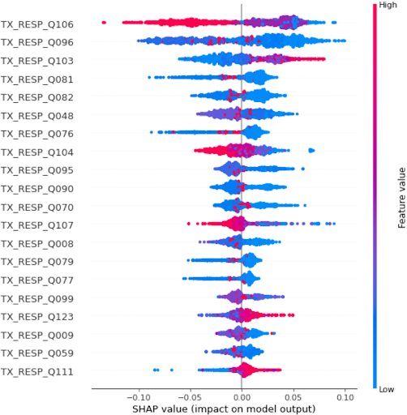

# TCC-Analise-Treinamento

A Ciência de Dados e o seu poder transformador vêm sendo utilizados em todos os âmbitos da sociedade. No âmbito educacional, temos a Ciência de Dados Educacionais que busca, através dos dados, encontrar respostas e soluções para problemas para que gestores e governantes possam agir. Neste trabalho é apresentado o processo de KDD na base de dados do Governo do Estado de São Paulo, onde são analisados dados do questionário dos professores de matemática dos 9º anos do ensino fundamental, do estado de São Paulo, classificados de acordo com a porcentagem de seus alunos acima da média estadual em matemática na Prova Brasil, prova que tem por finalidade o monitoramento do rendimento escolar brasileiro. Com o processo de mineração dos dados, pode-se obter modelos de machine learning que classificam se o professor teria sucesso nas notas de seus alunos a partir da análise das respostas do questionário. A partir disto, foi possível a obtenção de Shapley Values, que, combinados com uma técnica de visualização de dados, possibilita uma análise para tentar explicar o modelo e apresentar informações sobre quais questões do questionário que acarretam mais impacto na classificação do modelo, ou seja, possuem maior influência na classificação final. O modelo que obteve melhor performance foi o de Random Forest, alcançando 91% de acurácia no cálculo do cross validation. 

